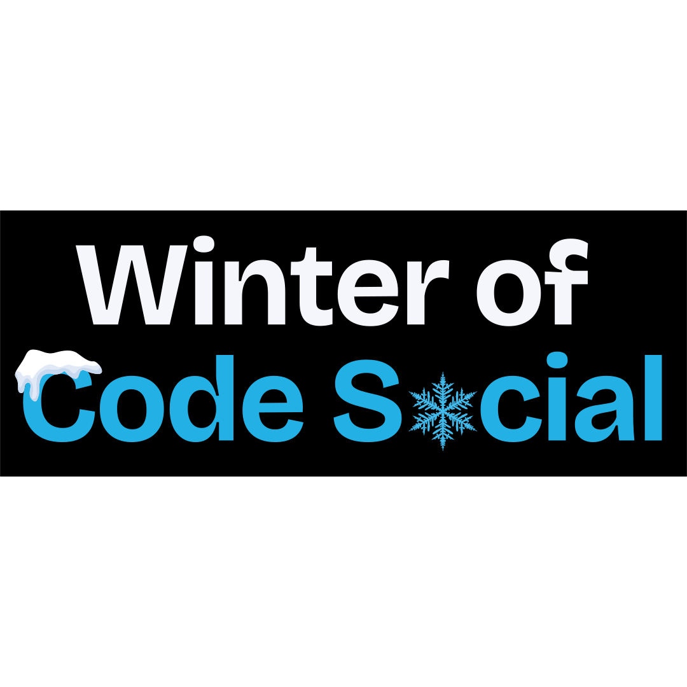

<p align="center">
  
</p>

# BYAMN Learning Platform

Transform YouTube learning into verified achievement with free certificates. Track progress, earn credentials, and advance your career with 200+ expert-led courses.

## About

BYAMN (Build Your Academic Mind Network) is an innovative learning platform that transforms YouTube content into structured, certifiable educational experiences. Our platform allows users to enroll in courses based on YouTube playlists, track their progress, and earn verified certificates upon completion.

## Features

- **Course Enrollment**: Browse and enroll in 200+ expert-led courses
- **Progress Tracking**: Monitor your learning journey with detailed progress indicators
- **Verified Certificates**: Earn authenticated certificates upon course completion
- **Mobile Responsive**: Access learning content on any device
- **User Dashboard**: Personalized dashboard to track enrolled courses and progress
- **Secure Authentication**: Firebase-based authentication system

## Technologies Used

- **Frontend**: HTML5, CSS3, JavaScript, Tailwind CSS
- **Backend**: Firebase (Authentication, Firestore, Realtime Database)
- **Deployment**: Vercel
- **Additional Libraries**:
  - jsPDF for certificate generation
  - html2canvas for certificate design capture

## Getting Started

- Read First This Then Start **https://github.com/DYHARDx/BYAMN-Learning/issues/3#issue-3567237056**

### Prerequisites

- A modern web browser (Chrome, Firefox, Safari, or Edge)
- Internet connection

### Installation

1. Clone the repository:
   ```bash
   git clone https://github.com/your-username/byamn-learning.git
   ```

2. Navigate to the project directory:
   ```bash
   cd byamn-learning
   ```

3. Open `index.html` in your web browser or deploy to a web server

### Firebase Configuration

The application uses Firebase for authentication and data storage. To configure your own Firebase project:

1. Create a Firebase project at [Firebase Console](https://console.firebase.google.com/)
2. Register your web app in Firebase
3. Update the Firebase configuration in `assets/js/firebase.js` with your project credentials

## Project Structure

```
BYAMN-Learning/
├── assets/
│   ├── css/
│   │   └── styles.css
│   └── js/
│       ├── auth.js
│       ├── certificate.js
│       ├── course-player.js
│       ├── courses.js
│       ├── dashboard.js
│       ├── firebase.js
│       ├── main.js
│       ├── student-courses.js
│       └── verification.js
├── auth/
│   ├── login.html
│   └── register.html
├── about.html
├── certificate.html
├── contact.html
├── courses.html
├── dashboard.html
├── faq.html
├── index.html
├── player.html
├── privacy.html
├── student-courses.html
├── terms.html
└── verification.html
```

## Contributing

We welcome contributions to improve the BYAMN Learning Platform. To contribute:

1. Fork the repository
2. Create a feature branch (`git checkout -b feature/AmazingFeature`)
3. Commit your changes (`git commit -m 'Add some AmazingFeature'`)
4. Push to the branch (`git push origin feature/AmazingFeature`)
5. Open a Pull Request

## License

This project is licensed under the MIT License - see the [LICENSE](LICENSE) file for details.

## Contact

For support or inquiries, please contact us through our [Contact Page](contact.html) or open an issue on GitHub.

## Acknowledgments

- Thanks to all YouTube content creators whose educational content inspired this platform
- Firebase for providing a robust backend infrastructure
- Tailwind CSS for the utility-first CSS framework
=======
# BYAMN-Learning
